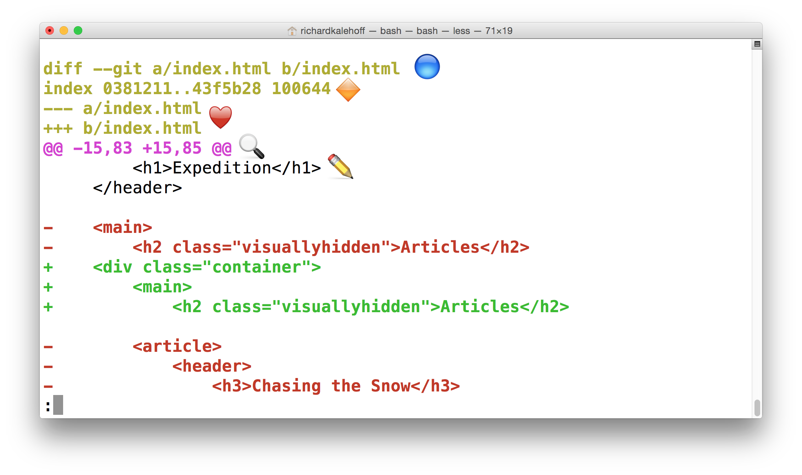

# Git helper

### Git Terminology and CheatSheet

[Git Cheat Sheet](Git_Cheatsheet.pdf)

[Git Terminology](Git_Terminology.pdf)

### Git init

In order to use this command is that easy as positioning into the directory you like to initialize the repo: 
```
...Desktop$ mkdir new_repository_directory
...Desktop$ cd new_repository_directory
...Desktop/new_repository_directory$ git init
```
then you will have your git repository locally in your own machine 

### .Git Directory Contents

Here's a brief synopsis on each of the items in the .git directory:

* **config file** - where all project specific configuration settings are stored.
From the [Git Book](https://git-scm.com/book/en/v2/Customizing-Git-Git-Configuration):

> Git looks for configuration values in the configuration file in the Git directory (.git/config) of whatever repository you’re currently using. These values are specific to that single repository.

For example, let's say you set that the global configuration for Git uses your personal email address. If you want your work email to be used for a specific project rather than your personal email, that change would be added to this file.

* **description file** - this file is only used by the GitWeb program, so we can ignore it

* **hooks directory** - this is where we could place client-side or server-side scripts that we can use to hook into Git's different lifecycle events. Also can be used to hook into different parts or events of Git's workflow.
* **info directory** - contains the global excludes file
* **objects directory** - this directory will store all of the commits we make
* **refs directory** - this directory holds pointers to commits (basically the "branches" and "tags")

### Git clone

The command is `git clone` and then you pass the path to the Git repository that you want to clone. An optional value could be the new name of the cloning repository you want to set. In this example, we are cloning the `repo repo_to_clone` and set it a new name `cloned_repo`

```
git clone https://github.com/Gonxis/repo_to_clone cloned_repo
```

### Git status

The output of running `git status` in the new-git-project project:

```
$ git status
On branch master

No commits yet

nothing to commit (create/copy files and use "git add" to track)
```

The output tells us some things:

1. `On branch master` – this tells us that Git is on the `master` branch. You've got a description of a branch on your terms sheet so this is the "master" branch (which is the default branch). We'll be looking more at branches in lesson 5
2. `Your branch is up-to-date with 'origin/master'.` – Because git clone was used to copy this repository from another computer, this is telling us if our project is in sync with the one we copied from. We won't be dealing with the project on the other computer, so this line can be ignored.
3. `nothing to commit, working directory clean` – this is saying that there are no pending changes. 

### Git log

The command line `git log` will display *by default* the following:

* the SHA
* the author
* the date
* the message

It can display a lot more information than just this

#### Navigating The Log

When running the command line `git log`, will open in the terminal [Less](https://en.wikipedia.org/wiki/Less_(Unix)) editor. Here are some helpful keys:

* to scroll down, press
    * j or ↓ to move down one line at a time
    * d to move by half the page screen
    * f to move by a whole page screen
* to scroll up, press
    * k or ↑ to move _up_ one line at a time
    * u to move by half the page screen
    * b to move by a whole page screen
* press q to quit out of the log (returns to the regular command prompt)

#### Git log --oneline

```
git log --oneline
```

This command:

* lists one commit per line
* shows the first 7 characters of the commit's SHA
* shows the commit's message

#### Git log --stat

The `git log` command has a flag that can be used to display the files that have been changed in the commit, as well as the number of lines that have been added or deleted. The flag is `--stat` ("stat" is short for "statistics")

```
git log --stat
```

This command:

* displays the file(s) that have been modified
* displays the number of lines that have been added/removed
* displays a summary line with the total number of modified files and lines that have been added/removed

#### Git log -p

The `git log` command has a flag that can be used to display the actual changes made to a file. The flag is `--patch` which can be shortened to just `-p`



Using the image above, let's do a quick recap of the `git log -p` output:

* 🔵 - the file that is being displayed
* 🔶 - the hash of the first version of the file and the hash of the second version of the file
    * not usually important, so it's safe to ignore
* ❤️ - the old version and current version of the file
* 🔍 - the lines where the file is added and how many lines there are
    * `-15,83` indicates that the old version (represented by the `-`) started at line 15 and that the file had 83 lines
    * `+15,85` indicates that the current version (represented by the `+`) starts at line 15 and that there are now 85 lines...these 85 lines are shown in the patch below
* ✏️ - the actual changes made in the commit
    * lines that are red and start with a minus (`-`) were in the original version of the file but have been removed by the commit
    * lines that are green and start with a plus (`+`) are new lines that have been added in the commit

#### See all branches at once

```
$ git log --oneline --decorate --graph --all
```

The `--graph` flag adds the bullets and lines to the leftmost part of the output. This shows the actual *branching* that's happening. The `--all` flag is what displays *all* of the branches in the repository.

### Git show

Running it like the example above will only display the most recent commit. Typically, a SHA is provided as a final argument:

```
$ git show fdf5493
```

The `git show` command will show *only one commit*. The output is exactly the same as the `git log -p` command. So by default, `git show` displays:

* the commit
* the author
* the date
* the commit message
* the patch information

However, `git show` can be combined with most of the other flags we've looked at:

* `--stat` - to show the how many files were changed and the number of lines that were added/removed
* `-p` or `--patch` - this the default, but if `--stat` is used, the patch won't display, so pass `-p` to add it again
* `-w` - to ignore changes to whitespace

### Git add

uses `git add` to add the files you want to the Staging Index:

```
$ git add index.html file_2 ... file_N
```


The git add command is used to move files from the Working Directory to the Staging Index.

```
$ git add <file1> <file2> … <fileN>
```

```
$ git add .
```

This command:

* takes a space-separated list of file names
* alternatively, the period `.` can be used in place of a list of files to tell Git to add the current directory (and all nested files)

### Git commit

The `git commit` command takes files from the Staging Index and saves them in the repository.

```
$ git commit
```

This command:

* will open the code editor that is specified in your configuration
    * (check out the Git configuration step from the first lesson to configure your editor)

Inside the code editor:

* a commit message must be supplied
* lines that start with a `#` are comments and will not be recorded
* save the file after adding a commit message
* close the editor to make the commit

Then, we use `git log` to review the commit we just made!

Here are some important things to think about when crafting a good commit message:

**Do**

* do keep the message short (less than 60-ish characters)
* do explain what the commit does (not how or why!)

**Do not**

* do not explain why the changes are made (more on this below)
* do not explain how the changes are made (that's what `git log -p` is for!)
* do not use the word "and"
    * if you have to use "and", your commit message is probably doing too many changes - break the changes into separate commits
    * e.g. "make the background color pink and increase the size of the sidebar"

The best way that I've found to come up with a commit message is to finish this phrase, "This commit will...". However, you finish that phrase, use that as your commit message.

### Git diff

The `git diff` command is used to see changes that have been made but haven't been committed, yet:

```
$ git diff
```

This command displays:

* the files that have been modified
* the location of the lines that have been added/removed
* the actual changes that have been made

### .gitignore

The `.gitignore` file is used to tell Git about the files that Git should not track. This file should be placed in the same directory that the `.git` directory is in.

In the `.gitignore` file, you can use the following:

* blank lines can be used for spacing
* `#` - marks line as a comment
* `*` - matches 0 or more characters
* `?` - matches 1 character
* `[abc]` - matches a, b, _or_ c
* `**` - matches nested directories - `a/**/z` matches
    * a/z
    * a/b/z
    * a/b/c/z

### Git tag

The command we'll be using to interact with the repository's tags is the git tag command:

```
$ git tag -a v1.0
```

with the flag `-a` in the command, we will be creating an annotated tag. Annotated tags are recommended because they include a lot of extra information such as:

* the person who made the tag
* the date the tag was made
* a message for the tag

If we don't provide the flag (i.e. `git tag v1.0`) then it'll create what's called a lightweight tag.

A Git tag can be deleted with the -d flag (for delete!) and the name of the tag:

```
$ git tag -d v1.0
```

Running `git tag -a v1.0` will tag the most recent commit. But what if you wanted to tag a commit that occurred farther back in the repo's history?

All you have to do is provide the SHA of the commit you want to tag!

```
$ git tag -a v1.0 a87984
```

(after popping open a code editor to let you supply the tag's message) this command will tag the commit with the SHA `a87084` with the tag `v1.0`.

### Git branch

The `git branch` command is used to interact with Git's branches:

```
$ git branch
```

It can be used to:

* list all branch names in the repository
* create new branches
* delete branches

If we type out just `git branch` it will list out the branches in a repository:


#### Create a branch

To create a branch, all you have to do is use `git branch` and provide it the name of the branch you want it to create. So if you want a branch called "sidebar", you'd run this command:

```
$ git branch sidebar
```

#### The `git checkout` command

When a commit is made that it will be added to the current branch. So even though we created the new `sidebar`, no new commits will be added to it since we haven't *switched to it*, yet. If we made a commit right now, that commit would be added to the `master` branch, *not* the `sidebar` branch. We've already seen this in the demo, but to switch between branches, we need to use Git's `checkout` command.

```
$ git checkout sidebar
```

It's important to understand how this command works. Running this command will:

* remove all files and directories from the Working Directory that Git is tracking
    * (files that Git tracks are stored in the repository, so nothing is lost)
* go into the repository and pull out all of the files and directories of the commit that the branch points to

So this will remove all of the files that are referenced by commits in the master branch. It will replace them with the files that are referenced by the commits in the sidebar branch.

#### The active branch

The *fastest* way to determine the active branch is to look at the output of the `git branch` command. An asterisk will appear next to the name of the active branch.

#### Delete a branch

If we want to delete the branch, we'd use the `-d` flag. The command below includes the `-d` flag which tells Git to *delete* the provided branch (in this case, the "sidebar" branch).

```
$ git branch -d sidebar
```

One thing to note is that we can't delete a branch that we're currently on. So to delete the `sidebar` branch, we'd have to switch to either the `master` branch or create and switch to a new branch.

Git won't let us delete a branch if it has commits on it that aren't on any other branch (meaning the commits are unique to the branch that's about to be deleted). If we created the `sidebar` branch, added commits to it, and then tried to delete it with the `git branch -d sidebar`, Git wouldn't let us delete the branch because we can't delete a branch that we're currently on. If we switched to the `master` branch and tried to delete the `sidebar` branch, Git *also* wouldn't let us do that because those new commits on the `sidebar` branch would be lost! To force deletion, we need to use a capital D flag - `git branch -D sidebar`.

So, the `git branch` command is used to manage branches in Git:

```
# to list all branches
$ git branch

# to create a new "footer-fix" branch
$ git branch footer-fix

# to delete the "footer-fix" branch
$ git branch -d footer-fix
```

This command is used to:

* list out local branches
* create new branches
* remove branches

Here is a way to change to a new branch just created with a single command line:

```
$ git checkout -b new-branch-as-same-location-as-master master
```

### Git merge

The git merge command is used to combine Git branches:

```
$ git merge <name-of-branch-to-merge-in>
```

When a merge happens, Git will:

* look at the branches that it's going to merge
* look back along the branch's history to find a single commit that *both* branches have in their commit history
* combine the lines of code that were changed on the separate branches together
* makes a commit to record the merge

#### Fast-forward Merge

When we merge, we're merging some other branch into the current (checked-out) branch. We're not merging two branches into a new branch. We're not merging the current branch into the other branch.

Since `new-branch` is directly ahead of `master`, this merge is one of the easiest merges to do. Merging `new-branch` into `master` will cause a **Fast-forward merge**. A Fast-forward merge will just move the currently checked out branch *forward* until it points to the same commit that the other branch (in this case, `new-branch`) is pointing to.

To merge in the `new-branch` branch, run:

```
$ git merge new-branch
```

#### Perform a Regular Merge

To merge in the `divergent-branch` branch, make sure you're on the `master` branch and run:


```
$ git merge divergent-branch
```

Because this combines two divergent branches, a commit is going to be made. And when a commit is made, a commit message needs to be supplied. Since this is a *merge commit* a default message is already supplied. It's common practice to use the default merge commit message.

#### What if a merge fails?

Git is able to intelligently combine lots of work on different branches. However, there are times when it can't combine branches together. When a merge is performed and fails, that is called a **merge conflict**.

If a merge conflict does occur, Git will try to combine as much as it can, but then it will leave special markers (e.g. `>>>` and `<<<`).

A merge conflict occurs when *the exact same line(s) are changed in separate branches*.

#### Merge Conflict Indicators Explanation

The editor has the following merge conflict indicators:

* `<<<<<<< HEAD` everything below this line (until the next indicator) shows you what's on the current branch
* `||||||| merged common ancestors` everything below this line (until the next indicator) shows you what the original lines were
* `=======` is the end of the original lines, everything that follows (until the next indicator) is what's on the branch that's being merged in
* `>>>>>>> heading-update` is the ending indicator of what's on the branch that's being merged in (in this case, the `heading-update` branch)

#### Resolving a merge conflict

To resolve a merge conflict, we need to:

1. choose which line(s) to keep
2. remove all lines with indicators

The `git merge` command is used to combine branches in Git:

```
$ git merge <other-branch>
```

There are two types of merges:

* Fast-forward merge – the branch being merged in must be *ahead* of the checked out branch. The checked out branch's pointer will just be moved forward to point to the same commit as the other branch.
* the regular type of merge
    * two divergent branches are combined
    * a merge commit is created

### Helpful Links

#### Git init

* [Initializing a Repository in an Existing Directory](https://git-scm.com/book/en/v2/Git-Basics-Getting-a-Git-Repository#Initializing-a-Repository-in-an-Existing-Directory)
* [git init docs](https://git-scm.com/docs/git-init)
* [git init Tutorial](https://www.atlassian.com/git/tutorials/setting-up-a-repository)

#### Git clone

* [Cloning an Existing Repository](https://git-scm.com/book/en/v2/Git-Basics-Getting-a-Git-Repository#Cloning-an-Existing-Repository)
* [git clone docs](https://git-scm.com/docs/git-clone)
* [git clone Tutorial](https://www.atlassian.com/git/tutorials/setting-up-a-repository)

#### Git status

* [Checking the Status of Your Files](https://git-scm.com/book/en/v2/Git-Basics-Recording-Changes-to-the-Repository#Checking-the-Status-of-Your-Files)
* [git status docs](https://git-scm.com/docs/git-status)
* [git status Tutorial](https://www.atlassian.com/git/tutorials/inspecting-a-repository/git-status)

#### Git Commit

* [How to get out of Vim](https://stackoverflow.com/questions/11828270/how-to-exit-the-vim-editor)
* [How to Write a Git Commit Message](https://chris.beams.io/posts/git-commit/)
* [A Note About Git Commit Messages](https://tbaggery.com/2008/04/19/a-note-about-git-commit-messages.html)

#### Further Research

* [Version Control on Wikipedia](https://en.wikipedia.org/wiki/Version_control)
* [Centralized vs. DVCS from the Atlassian Blog](http://blogs.atlassian.com/2012/02/version-control-centralized-dvcs/)
* [Distributed version control on Wikipedia](https://en.wikipedia.org/wiki/Distributed_version_control)
* [Git Internals - Plumbing and Porcelain](https://git-scm.com/book/en/v2/Git-Internals-Plumbing-and-Porcelain)
* [Customizing Git - Git Hooks](https://git-scm.com/book/en/v2/Customizing-Git-Git-Hooks)
* [Generating patches with -p](https://git-scm.com/docs/git-diff#_generating_patches_with_p)
* [Associating text editors with Git](https://help.github.com/articles/associating-text-editors-with-git/)
* [Getting Started - First-Time Git Setup](https://git-scm.com/book/en/v2/Getting-Started-First-Time-Git-Setup)
* [git diff](https://git-scm.com/docs/git-diff)
* [Ignoring files](https://git-scm.com/book/en/v2/Git-Basics-Recording-Changes-to-the-Repository#Ignoring-Files)
* [gitignore](https://git-scm.com/docs/gitignore#_pattern_format)
* [Ignoring files Article](https://help.github.com/articles/ignoring-files/)
* [gitignore.io](https://www.gitignore.io/)
* [Git Basics - Tagging](https://git-scm.com/book/en/v2/Git-Basics-Tagging)
* [Git Tag](https://git-scm.com/docs/git-tag)
* [Git Branching - Basic Branching and Merging](https://git-scm.com/book/en/v2/Git-Branching-Basic-Branching-and-Merging)
* [Learn Git Branching](http://learngitbranching.js.org/)
* [Git Branching Tutorial](https://www.atlassian.com/git/tutorials/using-branches)
* [Basic Merging](https://git-scm.com/book/en/v2/Git-Branching-Basic-Branching-and-Merging#Basic-Merging)
* [git-merge from Git Docs](https://git-scm.com/docs/git-merge)
* [git merge from Atlassian blog](https://www.atlassian.com/git/tutorials/git-merge)
* [Basic Merge Conflicts](https://git-scm.com/book/en/v2/Git-Branching-Basic-Branching-and-Merging#Basic-Merge-Conflicts)
* [How Conflicts Are Presented](https://git-scm.com/docs/git-merge#_how_conflicts_are_presented)